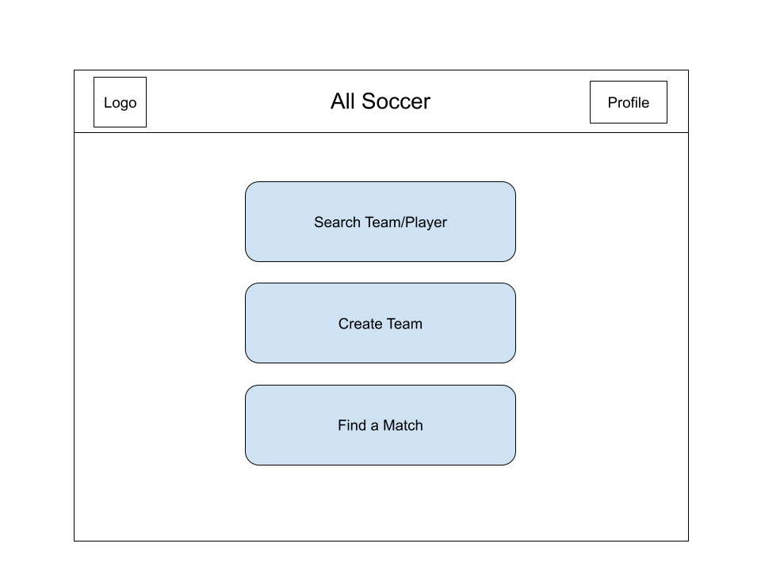

# All Soccer


## Note
Please do not refresh any page or go to paths directly by url/path since all routers are client-side. Direct server-side requests from browser will crash the app.

## Registered Usernames (password: 123)
 Oscar, Greenbook, David, Winson, Ajiao, Frankie, Test.

 ## Uncomplete work
 1. Manager edit player number, stats and match scores in team profile.
 2. Leave team and change team.
 3. Change team manager.
 4. Handle direct server-side requests(refresh page and direct url access).
 5. Better UI design.
 6. Upload avatar and team badges.

## Milestone 4 / Instructions
1. Register with a unique username and set the real name you wanna display in your profile.
2. You can create your own team with name (unique), city and initial players(with their usernames exist in db and currently have no team). In this way you become a manager.
3. Or search for a team and send a request to join. For example, request to join Metrotech-08 whose manager is Oscar. Log into Oscar to accept or decline the request.
4. A manager can create match invitations which will be shown publicly. A manager can search for matches based on time range and location to accept them.


## Milestone 3
You can create a team given its name, location based and several players. Team info not yet displayed except for its name in the profile of player who created the team. But the info is stored in database.


## Milestone 2
You can register, login and change your real name.


## Overview

Soccer enthusiats in NYC usually engage in the sport by playing pick-up games with random others(lower level), friendly matches between teams(medium level), and organized tournaments(higher level). Currently, there is no consistently operating website exclusive for amateur soccer teams to connect with each other.

All Soccer is a web app that will allow soccer teams to easily connect with each other and arrange matches formal or friendly. It is also a database for player stats, team conditions and match histories.


## Data Model

The application will store Players(Managers), Teams and Matches

* Each player belong's to one team (via reference)
* Each team can have multiple players (via embedding)
* Each match include two teams (via references)


An Example Player:

```javascript
{
  username: "soccerking",
  hash: // a password hash
  name: "Pele",
  team: //a reference to a team object
  isManager: false
}s
```

An Example Team:

```javascript
{
  name: "best team in the world",
  manager: "Jose Mourinho"
  players: [list of player _id],
  matches: [list of match _id]
  createdAt: // timestamp
}
```

An Example Match:

```javascript
{
  teams: [homeTeamName, awayTeamName]
  dateTime: //datetime object
  location: "Pier 40",
  status: "upcoming"
}
```


## [Link to DB Schema](back-end/db.js) 


## Wireframes

(__TODO__: wireframes for all of the pages on your site; they can be as simple as photos of drawings or you can use a tool like Balsamiq, Omnigraffle, etc._)

/home - home page


/login - page for logging in existing or creating new accounts


/search - page for searching teams and players in the database


/playerProfile - page for a player's information


/teamProfile - page for a team's information


/createTeam - page for creating a new team


## Site map (sample)


## User Stories or Use Cases

1. As an amateur soccer player, I want to challenge teams all over the city.
2. As a team manager, I want to reach out to other teams to arrange matches.
3. As any team member, I want to have my personal profile and team profile with past stats recorded.
4. As any team member, I want to research my opponents before playing against them.
5. As any team member, I want match highlight summaries for future review.
6. As any team member, I want a chat channel within the team.


## Research Topics

* (6 points) React.js
    * Building up front end with React.
* (3 points) Passport Authentication.

9 points total out of 8 required points


## [Link to Initial Main Project File](back-end/app.js) 


## Annotations / References Used

1. [Tutorial on React.js](https://reactjs.org/tutorial/tutorial.html)

